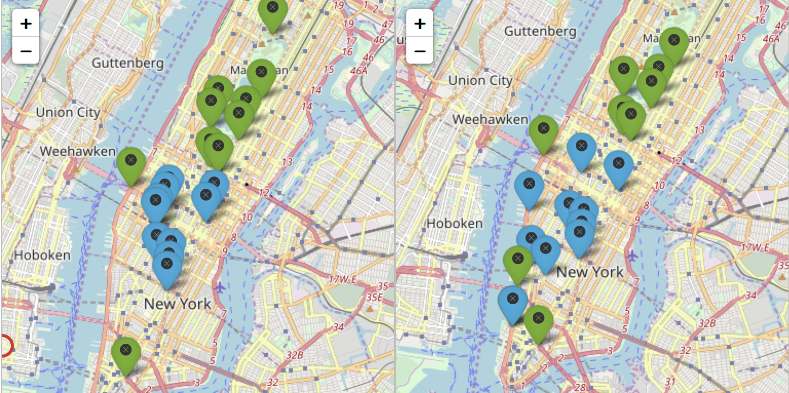

```{r, echo = F}
library(knitr)
opts_chunk$set(echo = F)
```

```{r, message = F, warning = F}
library(readr)
library(ggplot2)
library(dplyr)
library(lubridate)
```

One of the first trends we wish to explore is the variations in bike use across seasons on the few years that the service has been functioning.

More precisely, we will look at the average daily number of bike trips per month from October 2014 to September 2018 to see how that number varies from January to December. We expect less rides during the cold winter months as one would expect as winter in New York City is particularly rough. Few of us enjoy bike rides with an ice cold wind, and snow-infested roads.

We don't really know what to expect during the Summer months: on one hand there might be a surge in tourism and tourists renting bikes during this period but on the other commuters are fewer as people leave on vacation. In order to assess the seasonal effect on tourists and residents we will need to separate both groups and compare trends.

```{r, message = FALSE, warning = FALSE}
data <- read_csv("../data/summary_stats_per_day.csv")
```

```{r}
df_trips <- data[,c('Date', 'Trips')]
```

```{r}
df_trips_by_month <- df_trips %>%
  mutate(month = month(Date), year = year(Date))
df_trips_by_month <- df_trips_by_month %>%
  group_by(year, month) %>%
  summarise(avg_trips = mean(Trips))
df_trips_by_month$date <- as.Date(with(df_trips_by_month,
                                       paste(year, month, "01", sep="-")),
                                       "%Y-%m-%d")
```

```{r, fig.height = 4, fig.width = 7}
plot <- ggplot(data = df_trips_by_month, aes(x = date, y = avg_trips / 1000))
plot <- plot + geom_line(color = 'steelblue', size = 0.75)
plot <- plot + xlab("") + ylab("Trips (in thousands)")
plot <- plot + scale_x_date(breaks = "6 months", date_labels = "%b %Y")
plot <- plot + ggtitle("Evolution of the daily number of trips")
theme <- theme_bw() + theme(axis.text.x = element_text(angle = 60, hjust = 1))
theme <- theme + theme(text = element_text(family = 'Times'))
theme <- theme + theme(plot.title = element_text(hjust = 0.5))
plot <- plot + theme
plot
```

\begin{center}
\it{Fig 1. The average daily number of trips from October 2014 to September 2018}
\end{center}

As expected Winter months have much fewer trips than the Summer months, on which the number of trips peak. The number of trips was lowest in February 2015 - around 8,000 daily trips - and highest in June 2018 - around 67,000 daily trips. There is no denying there is an overall global increasing trend, as well as a seasonal component. 

One might wonder what the sharp increases between August 2015 and September 2015, July 2016 and September 2016 represent. We looked into it and found that those were critical months for Citibike that saw the deployment of a large number of bikes and new stations as part of their expansion plan. This probably led more people to at least try the bikes from new stations close to their home.

**How does this trend vary according to the status of the users?**

We note that Citibike devides its clients into `Customers` and `Subscribers`. `Customers` are those that use the bike with a `24-hour pass` or a `3-day pass` and `Subscribers` are annual members. The first group probably essentially contains visitors and tourists while the second group is more likely to represent New York City residents - one might wonder what the ratio of commuters to biking-for-fun users is amongst those, a question that requires more informative data to explore.

In the following, we will assume that `Customers` are tourists while `Subscribers` are NYC residents. This is a simplistic model that does not account for one-time users that use the bikes sporadically but live in NYC. From personal experience and user feedback, this seems to be a rare occurence and so it seems reasonable to assimilate those users in the tourist group.

We will compare the number of trips across the two groups for three months : February, July and October 2018.

```{r}
df <- read_csv("../data/concise_trips_cleaned.csv", col_types = 'iTTiiici?')
```

```{r}
df_condensed <- df[,c('starttime', 'usertype')]
```

```{r}
df2 <- df_condensed %>% group_by(month = floor_date(starttime, "month"), 
                      usertype) %>% summarize(count = n())
```

```{r}
f <- function(x) {
  if (x['usertype'] == "Customer") {
    x['count'] <- as.numeric(x['count']) / sum(df2[df2$usertype == "Customer", 3])
  } else {
    x['count'] <- as.numeric(x['count']) / sum(df2[df2$usertype == "Subscriber", 3])
  }
  return(x)
}

df2 <- apply(df2, 1, f)
df2 <- as.data.frame(t(df2))
```

```{r}
colnames(df2) <- c("month", "usertype", "frequency")
df2$frequency <- as.double(as.character(df2$frequency))
```
```{r}
df2$month <- c("February 2018", "February 2018",
               "July 2018", "July 2018",
               "October 2018", "October 2018")
```

```{r, fig.height = 3, fig.width = 6}
pl <- ggplot(df2, aes(usertype, frequency, fill = usertype)) + geom_col() 
pl <- pl + facet_wrap(~month) + xlab("User type") + ylab("Relative frequency")
pl <- pl + scale_fill_manual(values = c("salmon1", "paleturquoise3"))
theme2 <- theme_bw() + theme(text = element_text(family = 'Times'))
theme2 <- theme2 + theme(plot.title = element_text(hjust = 0.5))
pl <- pl + guides(fill = F) + theme2 
pl
```

\begin{center}
\it{Fig 2. The difference in relative frequency of trips across February, July and October between customers and subscribers}
\end{center}

The bar chart above shows the relative frequency of trips across different months between the two types of users - in which the height of a bar is the number of trips by that type of user during that month divided by the total number of trips by that type of users across those three months. It becomes evident that `Customers`, who we established were probably mostly tourists, use bikes much more during the Summer months than in Winter. This supports the hypothesis that most `Customers` are tourists, as looking at monthly reports on tourist arrivals from outside of the US to NY - from reports issued by the National Travel & Tourist Office - nearly twice as many tourists are registered during the Summer compared to the Winter months.

We expected lower numbers of trips during the Winter as supported by our earlier graph but here the number if clearly significantly lower for `Customer` compared to `Subscribers`. `Subscribers` probably still use bike in the Winter by necessity more than for leisure (commute, getting from point A to point B on time for various commitments) and are probably more prepared to rent bikes for the whole season with proper gear to face the cold and often snowy streets.

In October, the difference in relative usage of the bikes is not significantly different between `Customers` and `Subscribers`. This supports the hypothesis that the main difference in behavior between the two groups lies in the gap of the number of trips during Winter and Summer months.

**Most popular stations for tourists and residents**

Let us now visualize the most popular stations during Summer and Winter, for both residents and tourists. This could help us see if our hypothesis that most `Subscribers` during Winter months are commuters if the most popular stations for that group are in dense professional areas of the city. This would also help to see whether `Customers` are mostly tourists if the most popular stations are close to scenic or recreational areas. In fact, this would simply give us more insight in hotspots for Citibike use across both groups.

```{r}
stat_df <- df %>% select(c("starttime", "stoptime",
                           "start station id", "end station id",
                           "usertype"))
```

```{r}
stat_df_winter <- stat_df %>% filter(starttime < ymd("2018-04-01"))
stat_df_summer <- stat_df %>% filter(starttime < ymd("2018-09-01"),
                                     starttime > ymd("2018-05-31"))
```

```{r}
stat_df_winter <- stat_df_winter %>% group_by(`start station id`, 
                      usertype) %>% summarize(count = n())
stat_df_summer <- stat_df_summer %>% group_by(`start station id`, 
                      usertype) %>% summarize(count = n())
```

```{r}
stat_df_winter <- stat_df_winter %>% arrange(usertype, desc(count))
stat_df_summer <- stat_df_summer %>% arrange(usertype, desc(count))
```

```{r}
stat_df_winter_cus <- stat_df_winter %>% filter(usertype == "Customer")
stat_df_winter_sub <- stat_df_winter %>% filter(usertype == "Subscriber")
stat_df_summer_cus <- stat_df_summer %>% filter(usertype == "Customer")
stat_df_summer_sub <- stat_df_summer %>% filter(usertype == "Subscriber")
```

```{r}
most_pop_winter_cus <- head(stat_df_winter_cus, 10)$`start station id`
most_pop_winter_sub <- head(stat_df_winter_sub, 10)$`start station id`
most_pop_summer_cus <- head(stat_df_summer_cus, 10)$`start station id`
most_pop_summer_sub <- head(stat_df_summer_sub, 10)$`start station id`
```

```{r, message = F, warning = F}
stations <- read_csv("../data/stations_info.csv")
```

```{r}
pop_winter_cus <- stations %>% filter(id %in% most_pop_winter_cus)
pop_summer_cus <- stations %>% filter(id %in% most_pop_summer_cus)
```

```{r}
pop_winter_sub <- stations %>% filter(id %in% most_pop_winter_sub)
pop_summer_sub <- stations %>% filter(id %in% most_pop_summer_sub)
```

```{r}
library(leaflet)
```

```{r}
icon_blue <- awesomeIcons(
  icon = 'ios-close',
  iconColor = 'black',
  library = 'ion',
  markerColor = 'blue'
)
icon_green <- awesomeIcons(
  icon = 'ios-close',
  iconColor = 'black',
  library = 'ion',
  markerColor = 'green'
)
```

```{r}
library(magrittr)
library(mapview)
map_winter <- leaflet() %>% 
        addTiles()
map_winter <- map_winter %>%
  addAwesomeMarkers(lat = pop_winter_cus$latitude, 
             lng = pop_winter_cus$longitude, 
             label = pop_winter_cus$name,
             labelOptions = labelOptions(noHide = F),
             icon = icon_green) %>%
  addAwesomeMarkers(lat = pop_winter_sub$latitude, 
             lng = pop_winter_sub$longitude, 
             label = pop_winter_sub$name,
             labelOptions = labelOptions(noHide = F),
             icon = icon_blue)
```

```{r}
map_summer <- leaflet() %>% 
        addTiles()
map_summer <- map_summer %>%
  addAwesomeMarkers(lat = pop_summer_cus$latitude, 
             lng = pop_summer_cus$longitude, 
             label = pop_summer_cus$name,
             labelOptions = labelOptions(noHide = F),
             icon = icon_green) %>%
  addAwesomeMarkers(lat = pop_summer_sub$latitude, 
             lng = pop_summer_sub$longitude, 
             label = pop_summer_sub$name,
             labelOptions = labelOptions(noHide = F),
             icon = icon_blue)
```

\begin{center}
\it{Fig 3. The most popular stations by type of users in Winter (left) and Summer (right). Green markers represent the customer group (tourists) and blue markers represent annual members.}
\end{center}

From this plot the distinction between `Customer` preferences and `Subscriber` preferences jumps out. Preferred stations amongst `Subscribers` are all grouped tightly across Midtown and the North of Downtown Manhattan whereas `Customer` most popular stations are located around Central Park, with two exceptions: the station at `12 Ave & W 40 St`, ideally located for a scenic bike ride along the Hudson River Parkand the station at `Centre St and Chambers St`, ideally located for a bike ride across the Brooklyn Bridge, one of NYC's most iconic tourist destination. The pattern of popular stations for `Subscribers` in Winter crystallizes the hypothesis that the few `Subscribers` that still use Citibikes during the cold Winter months are mostly commuters that park their bike in the dense office building area of Midtown. `Customers` on the other hand exacerbates traits of tourists, with popular stations that span some of NYC's most touristic attractions.

Summer sees a loosening of the behavioral boundaries between `Customers` and `Subscribers`. As the conditions have become more welcoming for a leisure bike ride, NYC residents seem to use the bikes more to get to different places while still commuting a lot. There is a shift south for the most popular stations for `Subscribers` to the animated neighborhoods of Chelsea, Union Square, Soho and the Village, where residents find a lot of what New York City has to offer its residents. The stations favored by `Customers` remained practically the same as during the Winter months, further supporting the hypothesis that most `Customers` are indeed tourists.
